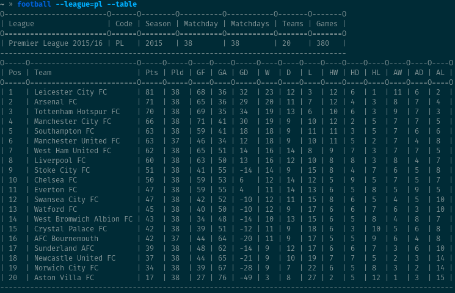

NAME
====

football - Command line program for accessing football data

SYNOPSIS
========

    football -t|--team=<Str>
    football -t|--team=<Str> -p|--players
    football -t|--team=<Str> -f|--fixtures [-s|--season=<Int>] [-T|--timeframe=<Str>] [-v|--venue=<Str>]
    football -L|--leagues [-s|--season=<Int>]
    football -l|--league=<Str> [-s|--season=<Int>]
    football -l|--league=<Str> -c|--teams [-s|--season=<Int>]
    football -l|--league=<Str> -t|--table [-s|--season=<Int>] [-m|--matchday=<Int>]
    football -l|--league=<Str> -f|--fixtures [-s|--season=<Int>] [-m|--matchday=<Int>] [-T|--timeframe=<Str>]
    football -F|--all-fixtures [-T|--timeframe=<Str>] [-c|--league-code=<Str>]
    football -v|--version

DESCRIPTION
===========

`football` helps you easily access information about football leagues, teams, fixtures, ...

It uses [football-data.org](http://football-data.org/) to get the football data.

OPTIONS
=======

  * **-t**=*TEAM*, **--team**=*TEAM*

    Print information about given *TEAM*.

      * **-p**, **--players**

        Print a list of *TEAM* players.

      * **-f**, **--fixtures**

        Print *TEAM*'s fixtures.

          * [**-s**=*YEAR*, **--season**=*YEAR*]

            Fixtures in season *YEAR*.

          * [**-T**=*TIMEFRAME*, **--timeframe**=*TIMEFRAME*]

            Limit fixtures to timeframe *TIMEFRAME*.

            *TIMEFRAME* is in the format of `n|p` followed by number of days, e.g. `n7`.

          * [**-v**=*VENUE*, **--venue**=*VENUE*]

            Limit fixtures to venue *VENUE*.

            *VENUE* is in the format of `home|away`.

  * **-L**, **--leagues**

    Print a list of available leagues.

      * [**-s**=*YEAR*, **--season**=*YEAR*]

        Leagues of season *YEAR*.

  * **-l**=*LEAGUE*, **--league**=*LEAGUE*

    Print information about given *LEAGUE*.

      * [**-s**=*YEAR*, **--season**=*YEAR*]

        League in season *YEAR*.

      * **-c**, **--teams**

        Print a list of *LEAGUE*'s teams/clubs.

      * **-t**, **--table**

        Print *LEAGUE*'s table.

          * [**-m**=*NUM*, **--matchday**=*NUM*]

            *LEAGUE*'s table on matchday *NUM*.

      * **-f**, **--fixtures**

        Print *LEAGUE*'s fixtures.

          * [**-m**=*NUM*, **--matchday**=*NUM*]

            *LEAGUE*'s fixtures on matchday *NUM*.

          * [**-T**=*TIMEFRAME*, **--timeframe**=*TIMEFRAME*]

            Limit fixtures to timeframe *TIMEFRAME*.

            *TIMEFRAME* is in the format of `n|p` followed by number of days, e.g. `n7`.

  * **-F**, **--all-fixtures**

    Print all fixtures from all leagues.

      * [**-T**=*TIMEFRAME*, **--timeframe**=*TIMEFRAME*]

        Limit fixtures to timeframe *TIMEFRAME*.

        *TIMEFRAME* is in the format of `n|p` followed by number of days, e.g. `n7`.

      * [**-c**=*LEAGUE_CODES*, **--league-code**=*LEAGUE_CODES*]

        Limit fixtures to leagues with *LEAGUE_CODES*.

        *LEAGUE_CODES* is in the format of league codes separated with ",", e.g. "PL", "PL,BL1,PD,CL".

  * **-v**, **--version**

    Display version and copyright information.

DIAGNOSTICS
===========

Error messages will be printed in the format of `football: ERROR_MESSAGE`.

When a resource is empty, error message will be in form of `football: RESOURCE not found`.

When a HTTP request results in a status code other than `200`, error message will be in the form of `football: HTTP_STATUS_CODE`.

When football-data.org returns an error message, an error message in the form of `football: football-data.org: ERROR_MESSAGE` will be printed.

EXAMPLES
========

To print fixtures of "Manchester City":

    football --team='manchester city' --fixtures

To print home games of "Manchester City" in the next 30 days:

    football -t=mancity -f --timeframe=n30 --venue=home

To print list of "Bayern Munich" players:

    football -t=bayern --players

To print list of "Premier League" teams in season 2014:

    football --league='premier league' --teams --season=2014

To print "Premier League" table on matchday 5:

    football -l='pl' --table --matchday=5

To print "Primera Division" fixtures of the last 7 days:

    football -l='pd' -f -T=p7

To print fixtures of "Premier League", "1. Bundesliga" and "Champions League":

    football --all-fixtures -c='pl,bl1,cl'

INSTALLATION
============

You need to have [Perl 6](https://perl6.org/downloads/) and [Panda](https://github.com/tadzik/panda) installed on your computer. Then you can run:

    panda install App::Football

to install `App::Football`.

REPOSITORY
==========

[https://gitlab.com/CIAvash/App-Football](https://gitlab.com/CIAvash/App-Football)

BUGS
====

[https://gitlab.com/CIAvash/App-Football/issues](https://gitlab.com/CIAvash/App-Football/issues)

AUTHOR
======

Siavash Askari Nasr - [http://ciavash.name/](http://ciavash.name/)

COPYRIGHT AND LICENSE
=====================

Copyright © 2016 Siavash Askari Nasr

App::Football is free software: you can redistribute it and/or modify it under the terms of the GNU General Public License as published by the Free Software Foundation, either version 3 of the License, or (at your option) any later version.

App::Football is distributed in the hope that it will be useful, but WITHOUT ANY WARRANTY; without even the implied warranty of MERCHANTABILITY or FITNESS FOR A PARTICULAR PURPOSE. See the GNU General Public License for more details.

You should have received a copy of the GNU General Public License along with App::Football. If not, see <http://www.gnu.org/licenses/>.
